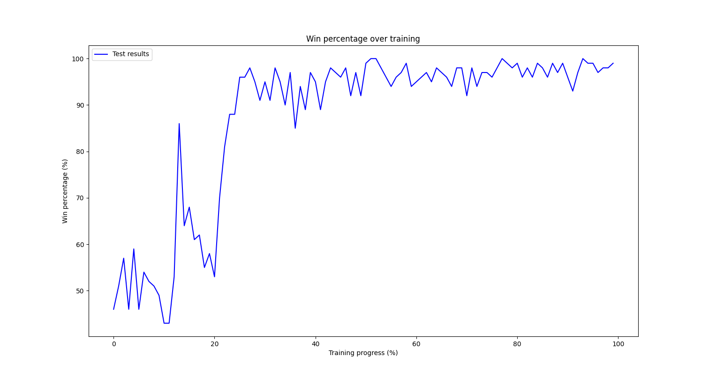

# AlphaZero
This project trains a deep reinforcement learning agent via self-play using Monte Carlo tree search (MCTS), in the style of [DeepMind's AlphaZero](https://www.deepmind.com/blog/alphazero-shedding-new-light-on-chess-shogi-and-go).

# Overview
This section provides a brief overview of the approach. 

## Neural Network
First we initialise the neural network. This forms the foundation of the agent and is the "agent's brain". In this implementation we have a dual head neural network, with a policy head and a value head. The neural network observes the environment, passes it through a series of convolutional layers, then a few dense layers, before splitting into policy and value heads. The policy head returns a probability distribution over actions (indicating the best action to take). The value head returns a prediction for the value of the board state for the current player (between -1 and 1).

$$(\mathbf{p}, v) = f_{\theta}(s)$$

Where $\mathbf{p}$ is the predicted policy, $v$ is the predicted value and $s$ is the state.

## Monte Carlo Tree Search (MCTS)
Next the agent plays one game. In order to do this the agent must decide on a move to make. The agent does this by running a Monte Carlo tree search. This simply consists of running a series of possible move simulations from the current state (which is set to be the root node of the tree).

Every node in the tree has a visit count $N(s, a)$, total action-value $W(s, a)$, mean action-value $Q(s, a)$ and prior probability of action $a$ in state $s$, $P(s, a)$.

Each simulation in the Monte Carlo tree search consists of the following three steps.

### 1) Select
Select a leaf node from the root node. This consists of traversing the tree until we hit a node that has not yet been expanded or is a terminal node and cannot be expanded. We traverse the tree by selecting nodes according to the PUCT algorithm. The PUCT algorithm selects a node with low visit count (to explore), high move probability (to exploit) and high value (to exploit). It does this by balancing these factors according to the UCB (Upper Confidence Bound) formula.

$$a_{t} = argmax_{a} \left( Q(s_{t}, a) + U(s_{t}, a) \right)$$

$$U(s, a) = C(s)P(s, a) \sqrt{N(s)}/(1+N(s, a))$$
$$C(s) = log\left( \left( 1+N(s) + c_{base} \right) / c_{base} \right) + c_{init}$$

Where $N(s)$ is the visit count of the parent node and $c_{init}$ and $c_{base}$ are parameters that control exploration/exploitation.

### 2) Expand
Expand the selected leaf node. A node corresponding to a non-terminal state can be expanded by adding new child nodes to the leaf node, with each corresponding to valid moves. Each new node is initialised with a visit count, total value and mean value of 0. The node we are expanding is also passed into the neural network to return the policy and value predictions. This policy prediction from the neural network is used to initialise the priors of each new child node. This ensures moves predicted with high probability are more likely to be selected in future simulations. The predicted value is used in the next step for backpropagation. Terminal nodes are not expanded, since no further moves can be made, but the value of terminal node is collected (-1 for a loss, 0 for a draw, +1 for a win).

$$(\mathbf{p}, v) = f_{\theta}(s_{L})$$
$$N(s_{L}, a) = 0$$
$$W(s_{L}, a) = 0$$
$$Q(s_{L}, a) = 0$$
$$P(s_{L}, a) = p_{a}$$

### 3) Backpropagate
The information is passed back up the tree from the newly expanded leaf node. For each node that has been traversed we increment the visit count by 1 and add the value to the total value of the node. The mean value of the node is also updated. Note: it is important to ensure the correct sign when incrementing the value. Remember the value is for the player in the newly expanded leaf node, so the parent node of this is the other player and the correct value will be the opposite of this. For example, if the value is 0.8 for the newly expanded leaf node, the value of the parent node to increment will be -0.8 and so on, as we move up the tree.

$$N(s_{t}, a) = N(s_{t}, a) + 1$$
$$W(s_{t}, a) = W(s_{t}, a) + v$$
$$Q(s_{t}, a) = W(s_{t}, a) / N(s_{t}, a)$$

Once all simulations have been run a move is selected according to the visit counts (either randomly sampling according to the visit counts for exploration or selecting the most visited node for exploitation). A policy proportional to the visit counts is also returned.

The policy is stored, the selected move is played and another search is run for the new state. The same tree is used throughout the game (resetting the search tree for each new game). This is repeated until the game is finished, when a series of states, policies and actions for each step are returned.

## Training the Agent
Once a game has finished the result is noted (-1 for a loss, 0 for a draw, +1 for a win). This is the true value of the game for the player (the other player's value is the opposite of this). This result is added to the series of states, policies and actions, and they are all subsequently added to the replay buffer. Once the agent has played enough games and acquired enough examples to begin learning, we randomly sample a set of experiences from the replay buffer. The states, policies and results obtained from the replay buffer are used to train the neural network. The neural network's loss function aims to minimise the policy loss and the value loss. The updated neural network is used in future games.

$$loss = (z-v)^{2} - \mathbf{\pi}^{\top}log(\mathbf{p})$$

Where $z$ is the game result (-1 for a loss, 0 for a draw, +1 for a win), $v$ is the predicted value, $\mathbf{\pi}$ is the search probabilities and $\mathbf{p}$ is the predicted policy.

# Structure

## Examples
Contains an example of training and evaluation of an agent for TicTacToe, including the neural network and a trained agent.

## Training
Contains the required training and evaluation functions, including the agent and MCTS implementation.

# Training a TicTacToe agent

## Parameters
```
# Training parameters
num_games = 3000
replay_buffer_size = 1500
batch_size = 750
epochs = 2

# MCTS parameters
num_simulations = 25
dirichlet_alpha = 0.7
noise_fraction = 0.7
c_base = 1
c_init = 0
num_sampling_moves = 6

# Neural network parameters
alpha = ExponentialDecay(initial_learning_rate=1e-2, decay_steps=2000, decay_rate=0.5, staircase=True)
```

## Results
### Agent performance during training


### Agent performance
Agent moving first against a random opponent for 1000 games
```
Win percentage: 99.6%
Draw percentage: 0.4%
Loss percentage: 0.0%
```

Agent moving second against a random opponent for 1000 games
```
Win percentage: 90.0%
Draw percentage: 9.9%
Loss percentage: 0.1%
```

# Getting Started

## Environment
Python 3.10.5

## Installation
1. Clone the repository
```
git clone https://github.com/alfiebeard/alphazero.git
```
2. Create virtual environment
```
conda create --name alphazero python=3.10.5
conda activate alphazero
```
Note: if using an M1 mac, please install the tensorflow dependencies 

```
conda install -c apple tensorflow-deps
```

3. Install the package
```
cd alphazero
pip install .
```

## Running
Train an agent on TicTacToe
```
python src/examples/tictactoe/train.py
```

Evaluate a trained agent
```
python src/examples/tictactoe/test.py
```

Play against a trained agent
```
python src/examples/tictactoe/play.py
```

# Extensions over AlphaZero
## Training for multiple epochs
In this implementation we train the agent for multiple epochs on the training examples. We saw an improved performance from training the agent for 2 epochs during each training cycle.

## Deduplication of overrepresented states
This implementation has been tested on smaller game environments (e.g., TicTacToe), instead of games with much larger state spaces (e.g., Chess, Go). In these smaller environments the games are much shorter (e.g., 5-9 moves per game for TicTacToe). This means that some states (e.g., the initial state and early states of the game) are massively overrepresented in the replay buffer, as they occur frequently. Consequently, during training the agents struggled to learn the end game, since these states are less frequent. To overcome this issue for shorter games, a deduplication procedure of overrepresented states has been implemented. This occurs during training when sampling from the replay buffer, where we remove duplicate states and average their results, we then sample from this deduplicated replay buffer for training.

# Next Steps
* Trial with other environments
* Improve training efficiency
* Further tuning
* Experiment with a vectorized gym environment

# License
Licensed under the [MIT License](LICENSE.md).
